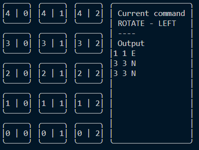

# martian-robots

Command-line tool to path out the way for a robot on Mars

## Usage

Before running the application, use `yarn` to install all dependencies. (If you don't have Yarn installed globally, you can run the binary from `.yarn/releases/yarn-berry.js`. It uses Yarn 2, so installing dependencies should be blazing fast since all dependencies are already cached inside the project.)

Then run `yarn start` to run the simulation. It uses `sample.txt` by default, but another file can be passed in like `yarn start my-own-file.txt`.

## Motivation

- Command-line app
- No compilation step
- Give some visual output

## General thoughts

- Wish I would have been able to use the `import` syntax, but `import-jsx` hooks into `require` making it incompatible to use ES2015 imports
- I couldn't figure out how to use Yarn 2 PnP in Node.js or if it's even possible
- I wish I could have been able to use Recoil, but unfortunately it depends on `react-dom` (https://github.com/facebookexperimental/Recoil/issues/99) making it impossible to use with other renderers
- I wish I had the project setup as a generator
- The pre-commit hooks and commitlint, it made sure I wouldn't use any shortcuts in implementation which was a blessing and a curse

## Things to improve on

- Interactive mode for inputting the path
- Can context help with prop drilling? Does it even make sense given it's not that deep?
- More unit tests
- Error handling

## License

MIT
